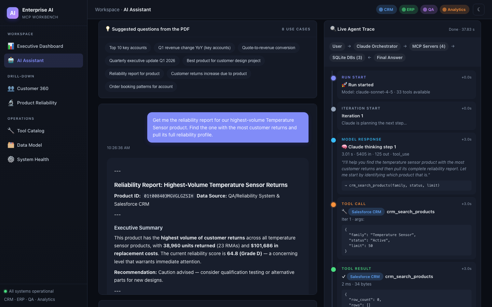
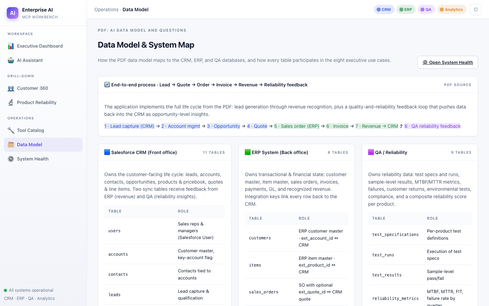
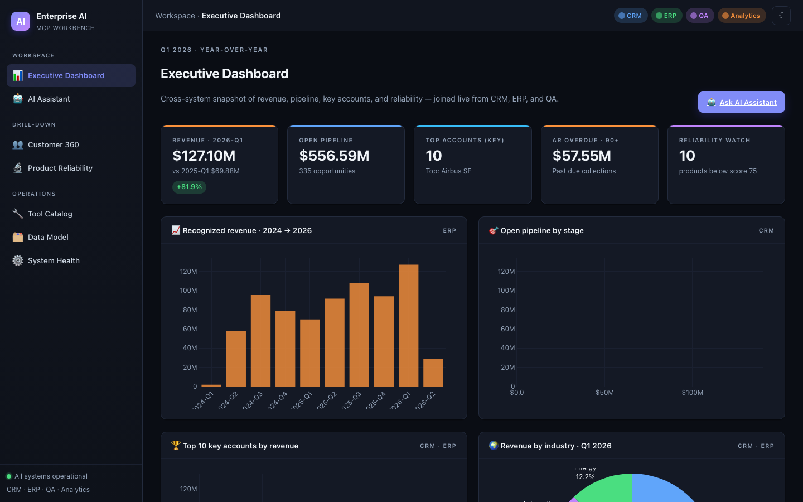

<div align="center">

# 🤖 MCP Enterprise Integration Demo

### Agentic AI across Salesforce CRM · ERP · QA / Reliability

*One natural-language question — four MCP servers — one executive answer.*

<br>


<br>

<p>


</p>

</div>

---

## ✨ What is this?

A working, end-to-end demo that proves an agentic-AI workflow can:

1. **Take a natural-language question** like _"Who are my top 10 key accounts?"_ or _"Is there any increase in customer returns for product TSN0124?"_
2. **Decide which of 33 tools** spread across **4 MCP servers** to call,
3. **Join data live across Salesforce CRM, an ERP, and a QA / reliability system**, and
4. **Return an executive-grade answer** with tables, visualizations, and a downloadable PowerPoint deck.

The data model and use cases come directly from the requirements PDF (Lead → Account → Opportunity → Quote → Order → Invoice → Revenue, with Product Reliability data flowing back into the CRM).

> **Why this matters:** real enterprises have answers locked in three different systems. This demo shows that a thin MCP layer plus Claude can collapse that boundary — no warehouse build, no ETL pipeline, no copy-and-paste between Salesforce and SAP.

---

## 🎯 Demo use cases (from the PDF)

| # | Audience | Question | Tools touched |
|---|---|---|---|
| 1 | 👔 Executive | Who are my top 10 key accounts? | `analytics_top_key_accounts` |
| 2 | 👔 Executive | Any big change in Q1 revenue YoY for key accounts? | `analytics_revenue_pattern_change` |
| 3 | 👔 Executive | Customers with highest / lowest quote→revenue conversion? | `analytics_quote_to_revenue_conversion` |
| 4 | 👔 Executive | Generate the Sales Quarterly Update presentation. | `analytics_quarterly_executive_update` |
| 5 | 💼 Sales | Best product for this customer design project? | `analytics_recommend_product_for_customer_project` |
| 6 | 💼 Sales | Reliability report for this product. | `crm_search_products` → `qa_customer_returns_by_product` → `qa_get_product_reliability_report` → `crm_get_reliability_insights_for_product` |
| 7 | 💼 Sales | Customer returns increase for this product? | `analytics_returns_increase_for_product` |
| 8 | 💼 Sales | Order booking patterns for my account. | `analytics_order_booking_patterns_by_account_name` |

All 8 questions are wired up as one-click chips in the web UI — and pass the automated QA harness (`scripts/qa_use_cases.py`) end-to-end.

---

## 🚀 Quick start

```bash
# 1. Install
python -m venv .venv && source .venv/bin/activate
pip install -r requirements.txt

# 2. Build the three databases and populate them with ~2.5 years of synthetic data
python databases/init_databases.py
python data_generation/generate_data.py

# 3. Render charts + the Sales Quarterly Update .pptx (optional)
python scripts/generate_outputs.py

# 4. Make sure your Anthropic key is reachable.
#    The web app auto-loads from ~/.env first, then ./.env (project local) —
#    no `export` needed if either file already has ANTHROPIC_API_KEY=…

# 5. Launch the executive web app
python scripts/run_webapp.py --port 8000
open http://127.0.0.1:8000
```

That's it — the agent spawns the four MCP servers as stdio subprocesses on first request.

Alternative run modes:

```bash
python scripts/qa_use_cases.py     # end-to-end QA harness — all 8 PDF questions
python scripts/demo_cli.py         # Rich-formatted CLI demo
```

---

## 🖥️ Executive AI Workbench (FastAPI web app)

A professional, executive-grade web application — seven pages, dark/light themes, and a live WebSocket trace that makes the agent-to-agent communication visible.

### 📊 Executive Dashboard

Cross-system snapshot: revenue KPIs with YoY delta, recognized-revenue trend, pipeline funnel, top key accounts, industry mix, YoY movers, reliability watch-list, AR aging.


### 🤖 AI Assistant — with Live Agent Trace

This is the centerpiece. Ask anything across CRM + ERP + QA, and the right-hand **Live Agent Trace** panel streams every step of the orchestration over a WebSocket: planning text from Claude, each tool call with its server label and JSON args, the result preview, token counts, and timing. Model selector (Sonnet 4.5 / Opus 4.7 / Haiku 4.5), persona switcher, suggested-question chips, and reset.



> The screenshot above shows use case #6 in flight — the agent chained **5 tool calls across CRM and QA** to assemble a reliability report. Every hop is timestamped and labeled by server.

### 👥 Customer 360

Pick an account → see CRM + ERP + QA together. Hero card with key-account flag and revenue, KPI strip (open pipeline, lifetime closed-won, quotes accepted, returns), booking-pattern chart by quarter, open opportunities, quotes, and recent orders.


### 🔬 Product Reliability Hub

Per-product reliability score (color-coded by grade), MTBF / failure-rate dual-axis trend, failure-mode distribution, return reasons, compliance status with expiry pills.


### 🗂️ Data Model & System Map

A built-in documentation page mapping the PDF data model to the three SQLite schemas — entity by entity, cross-system integration key by key, use case by tool. Live table inventory with row counts and on-demand sample rows.



### 🔧 Tool Catalog

All 33 MCP tools grouped by server with color-coded headers, search/filter, JSON-Schema-derived input forms, and a "Try it" invoker that calls the tool live and shows the raw JSON response.


### ⚙️ System Health

Four MCP-server status cards with tool counts, Anthropic runtime configuration (API key, model, total tools), per-database table inventory with column types.


### Dark theme

One-click toggle, persisted in `localStorage`. Every chart, table, pill, and KPI accent respects the theme.



### Design system

Custom CSS layer with design tokens for color, spacing, typography, and shadows. Server identity (**CRM = blue · ERP = green · QA = purple · Analytics = orange**) is used consistently across pills, KPI accents, section headers, and timeline event markers in the live trace. KPI cards carry a 3 px accent stripe and uppercase eyebrow label. Markdown answers render with full tables, code, and links.

```
webapp/
├── main.py                 # FastAPI app, lifespan-managed MCP client
├── env_loader.py           # Auto-loads ~/.env then ./.env on startup
├── agent_runner.py         # Streams agent events to WebSocket subscribers
├── api/
│   ├── routes.py           # Server-rendered page routes
│   ├── data.py             # REST endpoints for dashboards & manual tool invocation
│   └── ws.py               # /ws/agent — live agent trace WebSocket
├── templates/              # Jinja2 templates (base + 7 pages)
└── static/
    ├── css/theme.css       # Design tokens + components + dark mode
    ├── css/assistant.css   # Chat thread + agent-trace timeline
    └── js/*                # util · theme · per-page rendering
```

No build step. No JS framework. Plotly via CDN, custom CSS, vanilla JS.

---

## 📊 What you get out

The agent produces real artifacts. Here is what came out of one full test run.

<details open>
<summary><b>Top 10 key accounts</b> — single tool call to <code>analytics_top_key_accounts</code></summary>


</details>

<details>
<summary><b>Q1 2026 vs Q1 2025 revenue pattern change</b> — key accounts only</summary>


Boeing **+9,136 %**, Medtronic **+465 %**, Volkswagen **+365 %**. Lockheed Martin **-62.5 %**, Raytheon **-100 %**.

</details>

<details>
<summary><b>Quote → revenue conversion</b> — which accounts close and which don't</summary>


</details>

<details>
<summary><b>Customer returns trend</b> — is the temperature sensor TSN0124 getting worse?</summary>


</details>

<details>
<summary><b>Open pipeline by stage</b> & <b>Q1 2026 revenue by industry</b></summary>

<table>
<tr>
<td></td>
<td></td>
</tr>
</table>

</details>

<details>
<summary><b>Recognized revenue by quarter</b> — full 2024 → 2026 series</summary>


</details>

Plus a downloadable **9-slide Sales Quarterly Update PowerPoint** (`outputs/sales_quarterly_update_2026-Q1.pptx`), generated by `analytics_quarterly_executive_update` → `python-pptx`.

---

## 🧭 How the agent routes questions

Heat-map of which MCP server answered each of the 8 use cases (generated from the actual end-to-end run):


Notice how the agent picks the **cross-system Analytics server** for most questions but happily chains together CRM + QA tools when it needs to (use case #6 — find a product → find returns for it → pull the full reliability report → check the CRM-side insights).

---

## 🏗️ Architecture deep-dive

### The four MCP servers

| Server | Module | Tools | Owns |
|---|---|---|---|
| 🟦 **Salesforce CRM** | `mcp_servers.crm.server` | 10 | Leads, Accounts, Contacts, Opportunities, Products, Pricebook, Quotes, Quote Line Items, plus revenue & reliability sync tables |
| 🟩 **ERP System** | `mcp_servers.erp.server` | 9 | Customer master, Items master, Sales Orders, Invoices, Payments, GL entries, recognized Revenue |
| 🟪 **QA / Reliability** | `mcp_servers.qa.server` | 7 | Test specs, Test runs, Test results, Reliability metrics (MTBF/MTTR/FIT), Failures, Customer Returns, Environmental tests, Compliance records, Reliability scores |
| 🟧 **Analytics** | `mcp_servers.analytics.server` | 7 | Cross-system joins via SQLite `ATTACH` — top key accounts, YoY patterns, quote→revenue conversion, product-fit + reliability, quarterly exec update, returns trend |

Each is a standalone stdio process that the agent spawns on demand.

### Cross-system integration model

Every CRM `account.id` lives as the **`external_account_id`** in the ERP customer master, and on every QA failure / return record. CRM `product.id` lives as ERP `external_product_id`. Accepted CRM quotes carry an `external_order_id` link to the ERP order they spawned, and the ERP order carries the inverse `external_quote_id`. Revenue rows propagate the `external_account_id` so analytics joins are free.

```
 CRM accounts.id  ─────────────►  ERP customers.external_account_id
                  ─────────────►  QA failures.external_account_id
                  ─────────────►  QA customer_returns.external_account_id

 CRM products.id  ─────────────►  ERP items.external_product_id
                  ─────────────►  QA test_specifications.external_product_id
                  ─────────────►  QA reliability_metrics.external_product_id

 CRM quotes.id   ◄─────────────►  ERP sales_orders.external_quote_id

 ERP invoices    ─────────────►  CRM quote_revenue_sync (back-sync)
 QA scores       ─────────────►  CRM reliability_insights_sync (back-sync)
```

This mirrors how a real Salesforce↔SAP↔Quality-System integration is wired.

### Agent loop

1. User prompt + tool catalog (the 33 MCP tools, each tagged with its server) is sent to **Claude Sonnet 4.5**.
2. Claude returns either a final answer or a list of `tool_use` blocks.
3. For each `tool_use`, the orchestrator routes the call to the right MCP server over stdio, gets JSON back, and feeds it as a `tool_result` block.
4. Repeat until Claude emits `stop_reason: end_turn`.

Every step is also pushed to subscribers of the FastAPI `/ws/agent` WebSocket so the UI can render the trace as it happens.

Typical run: **1 – 4 iterations, 1 – 5 tool calls, 13 – 40 seconds wallclock**.

---

## 🧱 Tech stack

| Layer            | Choice                              | Why                                                        |
|------------------|-------------------------------------|------------------------------------------------------------|
| Databases        | SQLite × 3 (CRM / ERP / QA)         | Three isolated systems, zero infra — copies the topology   |
| MCP servers      | Python + official `mcp` SDK 1.27    | Standard stdio MCP protocol — same wire format as Claude Desktop |
| Agent            | Anthropic Claude Sonnet 4.5         | Best tool-use model for multi-step reasoning               |
| Web framework    | FastAPI + Uvicorn + Jinja2          | Async server, WebSocket streaming, no build step           |
| Frontend         | Vanilla JS + custom CSS tokens + Plotly | Zero JS framework, dark/light theming, executive look     |
| Synthetic data   | `Faker` + curated industry reference | Real Fortune-1000 names, real semiconductor taxonomy, real test standards |
| Charts           | Plotly + Kaleido                    | Interactive HTML in the UI, PNG for the deck               |
| Presentations    | `python-pptx`                       | 16:9 executive deck, programmatically built                |
| CLI              | Rich                                | Live tool-call streaming with colors and tables            |
| Browser testing  | Playwright                          | UI smoke tests + agent-trace verification screenshots      |

---

## 📦 Data overview

| Database | Tables | Rows (approx) |
|----------|--------|---------------|
| 🟦 CRM   | 11 | ~14,000 — 92 accounts (25 key), 132 products (15 flagged problematic), 563 leads, 1,966 opportunities, 2,856 quotes, 7,137 line items |
| 🟩 ERP   | 9  | ~10,000 — 92 customers, 132 items, 776 sales orders, 756 invoices, 1,763 revenue rows, GL entries, payments |
| 🟪 QA    | 9  | ~83,000 — 635 test specs, 2,514 test runs, **75,420 sample-level test results**, 1,320 reliability metrics, 863 failures, 552 customer returns |

**Time window:** `2024-01-01 → 2026-05-15` (today).

**Calibration:** Q1-25 vs Q1-26 deltas are large enough to surface real changes; account revenue follows a Pareto distribution with the top 10 key accounts dominating; ~12 % of products are intentionally given elevated failure rates so the reliability and returns questions return interesting results.

**Realism:** account names are real publicly-listed companies (Tesla, Lockheed Martin, Bosch, Medtronic…); product categories follow standard semiconductor taxonomy (DC-DC converters, Hall sensors, AEC-Q100 MCUs, SiC MOSFETs…); test standards are real (JESD22-A108, MIL-STD-883, AEC-Q100); failure modes are textbook FMEA.

A full schema-to-PDF mapping is in `docs/DATA_MODEL.md` — and rendered live in-app at **`/data-model`**.

---

## 📂 Repo layout

```
crm_erp_v1/
├── databases/                       # SQLite DBs + schemas
│   ├── schema_{crm,erp,qa}.sql
│   ├── {crm,erp,qa}.db              # generated
│   └── init_databases.py
├── data_generation/                 # Realistic synthetic-data generator
│   ├── reference_data.py            # Real company names, product taxonomy, standards
│   └── generate_data.py
├── mcp_servers/                     # Four MCP servers (stdio)
│   ├── common.py                    # Shared DB helpers
│   ├── server_base.py               # Shared MCP scaffolding
│   ├── crm/        {tools,server}.py
│   ├── erp/        {tools,server}.py
│   ├── qa/         {tools,server}.py
│   └── analytics/  {tools,server}.py
├── agent/                           # Agentic AI orchestrator
│   ├── mcp_client.py                # Connects to all 4 MCP servers over stdio
│   ├── orchestrator.py              # Anthropic Claude + tool-use loop
│   ├── visualizations.py            # Plotly charts (PNG + HTML)
│   └── presentation.py              # python-pptx executive deck
├── webapp/                          # ★ FastAPI executive UI (current)
│   ├── main.py                      # FastAPI app + lifespan-managed MCP client
│   ├── env_loader.py                # Auto-loads ~/.env then ./.env
│   ├── agent_runner.py              # Streams every event to WebSocket subscribers
│   ├── api/{routes,data,ws}.py      # Pages · REST data · WS agent stream
│   ├── templates/*.html             # Base + 7 page templates
│   └── static/{css,js}/             # Design tokens + per-page UI scripts
├── ui/                              # Legacy Streamlit prototype (kept for reference)
├── scripts/
│   ├── run_webapp.py                # ★ Start the FastAPI app
│   ├── qa_use_cases.py              # Automated QA — runs all 8 PDF questions
│   ├── qa_smoke.py                  # Playwright UI smoke + screenshots
│   ├── demo_cli.py                  # Rich-formatted CLI demo
│   └── generate_outputs.py          # Render all charts + .pptx
├── tests/
│   └── use_cases.py                 # The 8 PDF questions as prompts
├── docs/
│   ├── DATA_MODEL.md                # Schema-to-PDF mapping
│   └── images/                      # README + in-app assets
└── outputs/                         # Generated charts + .pptx (gitignored)
```

---

## ▶️ Run modes

### 1. Executive AI Workbench (recommended)

```bash
python scripts/run_webapp.py --port 8000
open http://127.0.0.1:8000
```

### 2. End-to-end QA harness

```bash
python scripts/qa_use_cases.py
# → outputs/qa_use_case_runs.md   (human-readable transcript)
# → outputs/qa_use_case_runs.json (structured trace per question)
```

Runs all 8 PDF questions through the live agent over WebSocket and verifies each completes with a non-empty answer and at least one tool call. Recent run: **8/8 passed**, 190.6s total, 12 tool calls.

### 3. CLI demo

```bash
python scripts/demo_cli.py              # interactive menu of the 8 questions
python scripts/demo_cli.py 4            # run use case #4 directly
python scripts/demo_cli.py "Show me Lockheed Martin's order trend by quarter"
```

You get live, color-coded tool-call streaming in the terminal.

### 4. Legacy Streamlit UI (kept for reference)

```bash
streamlit run ui/streamlit_app.py
```

The Streamlit prototype is still in the repo but the FastAPI app is the supported interface going forward.

---

## 🧪 Example: full agent transcript

> **Q:** _Lockheed Martin shows declining Q1 revenue YoY. Pull their booking pattern and the open pipeline so I can see what's coming._

```
Iter 1  →  Analytics (cross-system) :: analytics_order_booking_patterns_by_account_name  (0.04s)
Iter 2  →  Salesforce CRM           :: crm_get_account_summary                           (0.01s)
Iter 2  →  Salesforce CRM           :: crm_list_opportunities                            (0.01s)
Iter 3  →  (final answer)
```

> ## Lockheed Martin Analysis: Q1 2026 Revenue Decline
>
> **Source:** ERP booking data + Salesforce CRM pipeline
>
> ### Key Findings
> **Q1 2026 booking patterns show a sharp decline:**
> - Q1 2026: Only $1.996M booked across 3 orders
> - Q1 2025: $15.17M booked across 7 orders
> - **YoY decline:** -87 % in Q1 booking value
>
> **Total relationship metrics (CRM):**
> - Open pipeline: $21.38M
> - Historical closed-won: $157.14M lifetime
> - Total opportunities: 56
>
> **Weighted pipeline value: ~$7.6M**

The agent picked the right tools, joined data from two systems, and wrote a clean exec summary — all from a single English sentence.

---

## 🛠️ Built-in MCP tools (33 total)

<details>
<summary><b>🟦 Salesforce CRM (10)</b></summary>

- `crm_list_accounts` — Filter by industry, segment, country, key flag
- `crm_get_account_summary` — One account with pipeline, won amount, contacts
- `crm_list_opportunities` — Multi-filter on stage / owner / amount / close date
- `crm_pipeline_summary_by_stage` — Rollup with weighted and unweighted $
- `crm_opportunity_funnel` — Won/Lost counts and $ for a period
- `crm_list_quotes` — Filter by account / status / date
- `crm_get_quote_detail` — Quote + line items + ERP revenue sync
- `crm_search_products` — Catalog filter by family / category / temp / qualification / price
- `crm_find_product_for_requirements` — Score-rank products by design fit
- `crm_get_reliability_insights_for_product` — QA-synced insights for the product

</details>

<details>
<summary><b>🟩 ERP (9)</b></summary>

- `erp_list_customers` — By external account id / class / country
- `erp_list_sales_orders` — Multi-filter
- `erp_order_booking_patterns` — Order count + $ per month / quarter
- `erp_get_order_detail` — Order + lines + customer + quote link
- `erp_list_invoices` — Multi-filter
- `erp_ar_aging` — Aging buckets (Current / 1-30 / 31-60 / 61-90 / 90+)
- `erp_revenue_by_period` — Group by customer / product family / region / period
- `erp_top_customers_by_revenue` — Top N
- `erp_revenue_yoy_comparison` — Two-quarter customer-level comparison

</details>

<details>
<summary><b>🟪 QA / Reliability (7)</b></summary>

- `qa_get_product_reliability_report` — Score, MTBF, failures, returns, compliance, tests
- `qa_customer_returns_by_product` — Aggregate by product
- `qa_returns_trend_for_product` — Month / quarter trend
- `qa_customer_returns_by_account` — Rolled up by account
- `qa_list_reliability_scores` — Filter by score / grade
- `qa_list_failures` — Multi-filter
- `qa_test_run_summary` — Recent runs with pass/fail counts

</details>

<details>
<summary><b>🟧 Analytics (7) — cross-system</b></summary>

- `analytics_top_key_accounts` — CRM key flag + ERP revenue → top N
- `analytics_revenue_pattern_change` — Two-quarter delta for key accounts
- `analytics_quote_to_revenue_conversion` — Highest / lowest converting accounts
- `analytics_order_booking_patterns_by_account_name` — Lookup by CRM name
- `analytics_recommend_product_for_customer_project` — Design fit + QA reliability blend
- `analytics_quarterly_executive_update` — Everything needed for the exec deck
- `analytics_returns_increase_for_product` — Trend + recent-vs-prior + accounts

</details>

---

## ⚙️ Configuration

| Variable | Default | Purpose |
|---|---|---|
| `ANTHROPIC_API_KEY` | _(required)_ | Claude API key — picked up automatically from `~/.env` or `./.env` |
| `CRM_DEMO_MODEL` | `claude-sonnet-4-5` | Override the model (e.g. `claude-opus-4-7`) |
| `ANTHROPIC_BASE_URL` | `https://api.anthropic.com` | Useful for proxies / corp gateways |

---

## 📝 License

Sample/demo code. Use freely.

---

<div align="center">

**Built to show that MCP turns three siloed enterprise systems into one conversational interface.**

</div>
